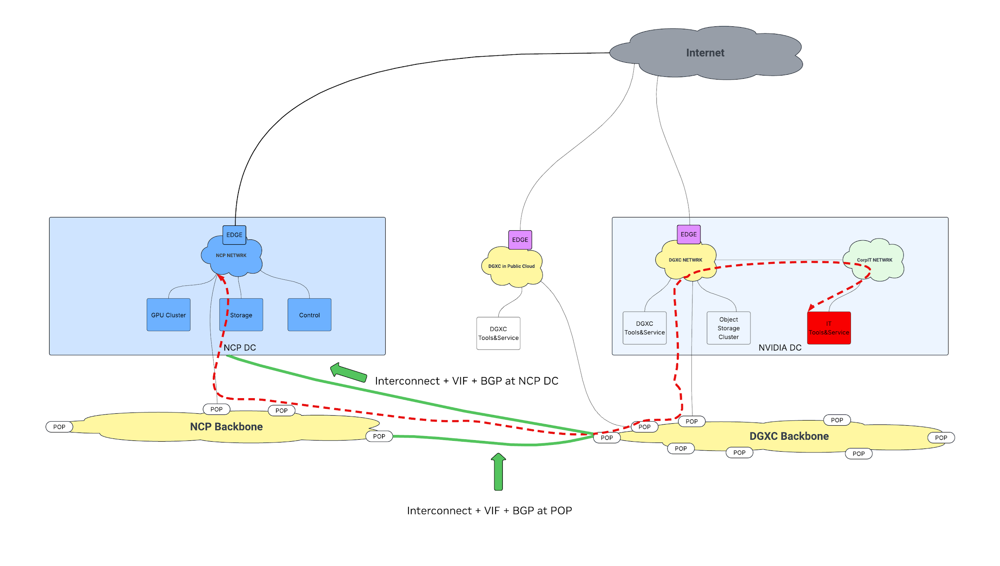
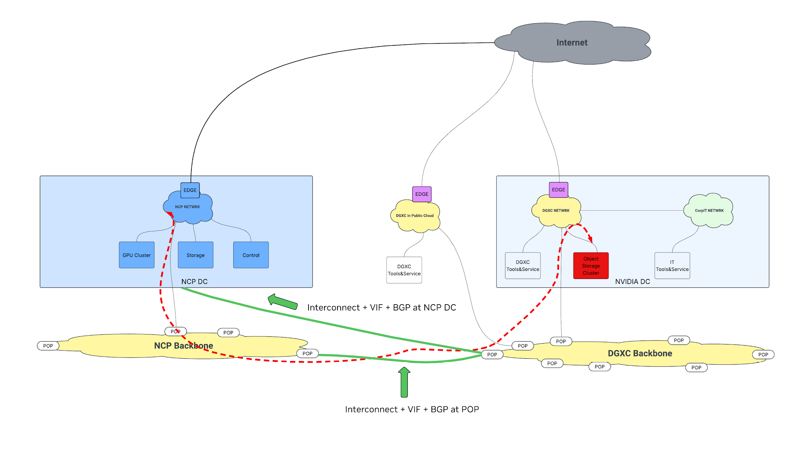
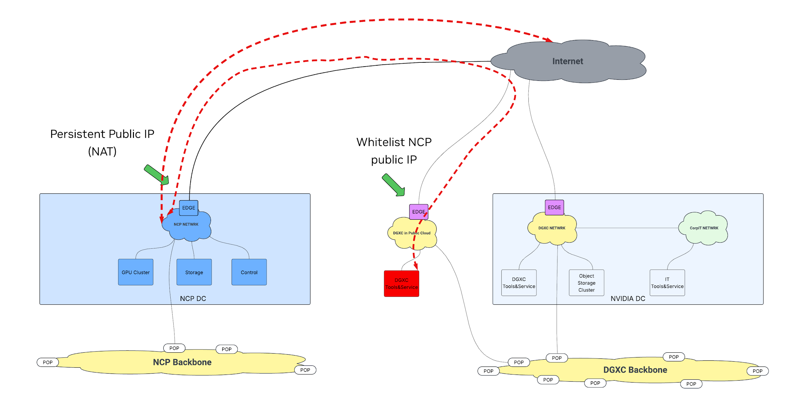

# NVIDIA Requirements for AI Clouds

| Version | Date         | Description of Change |
| :------ | :----------- | :-------------------- |
| 2.1     | Feb 26, 2026 | Initial version       |
| 2.2     | Apr 10, 2026 | Update to v2.2        |
| 2.3     | Jun 25, 2026 | Update to v2.3        |

## Purpose and Intent

This document serves three main purposes:

1. **Setting requirements for NVIDIA Cloud Partners (NCPs) delivering GPU capacity to NVIDIA**\
   This is the primary requirements document from NVIDIA to any NCP providing NVIDIA GPU/AI compute and software services. These requirements cover the full stack of AI cloud infrastructure services and operations needed to run NVIDIA DGX Cloud, expanding on the NVIDIA hardware reference design.
2. **Providing a reference set of requirements for the industry**\
   NVIDIA is publishing this document openly so that NCPs, GPU datacenter operators, and AI practitioners can use it as a reference for the capabilities a large GPU consumer requires.
3. **Defining NVIDIA's service delivery expectations**\
   NVIDIA expects services to be delivered as generally available services, not as bespoke implementations built for NVIDIA alone. NVIDIA also expects operational excellence, transparent communication, and proactive engagement from all partners.

NVIDIA will consider additional services that an NCP offers or plans to offer beyond what is described here.

## Service Delivery SLAs

NCPs should be able to demonstrate their ability to meet the SLAs and operational requirements below, by category, to be considered for offtake.

### Service Delivery Timelines

The NCP must demonstrate API readiness and transport establishment at least 12 weeks ahead of GPU delivery. Additionally, the NCP must provide development capacity (ancillary CPU nodes only) and high-performance storage capacity with the API integrated 8 weeks before GPU and cluster delivery. At this T-minus-8-week milestone, the [Data Movement Systems Requirements](#data-movement-systems-requirements) must be met.

### SLAs and SLOs

#### Managed K8s

* Control Plane SLA target: Financially-backed 99.95%+ uptime for production.

#### Storage

* Performance (QoS): Must provision the requested minimum throughput and IOPS.
* Home Directory Storage:
  * Availability: Over 99.99% availability for unplanned incidents, exclusive of scheduled maintenance.
  * Durability: Over 99.99% for any FS less than 1 PB.
* High-Speed Storage Service Requirements:
  * Availability (SLO): Must meet 99.99% availability in a 30-day rolling SLO exclusive of maintenance.
* High-Speed Storage Filesystem Requirements:
  * End-to-end Availability: Over 99.5% uptime per PB.
  * Durability: Over 99.999% durability per PB annually.

#### Operational Requirements

* Dedicated technical specialist or engineer available to NVIDIA.
* Slack channel monitored by a technical specialist or engineer.
* 24x7 support available per the partner's standard incident severity procedures, including emergency access recovery.
* Service-impacting incidents and planned and unplanned maintenance events are communicated to NVIDIA.
* For planned maintenance, NVIDIA can schedule maintenance windows through APIs or console tools, avoid unexpected outages, and provide feedback.
* NCP must remediate critical vulnerabilities in a timely manner while providing transparent disclosure of any issues.

#### Telemetry

NCP shall deliver all required telemetry, including metrics and logs, with a latency of no longer than 120 seconds.

#### Testing Compliance

The requirements described in this document can largely be validated using the tests in the [AI Cloud Ready test suite](https://github.com/NVIDIA/ISV-NCP-Validation-Suite). See the AI Cloud Ready documentation for details on how to run the tests. Tests are added regularly, so review the [Requirements Test Matrix](https://github.com/NVIDIA/ai-cloud-validation/blob/main/docs/requirements/test-requirements-matrix.adoc) to find which tests validate which requirements.

#### Exemplar Cloud Workload Performance

NVIDIA Exemplar Cloud seeks to improve performance per TCO with hardware and software recipes, references, tools, and capabilities. Run the latest publicly available release from [https://github.com/NVIDIA/dgxc-benchmarking](https://github.com/NVIDIA/dgxc-benchmarking) and always select the latest release version from the GitHub repository. The release must be completed successfully on one uniform hardware cluster type. Run all workloads for a given release and share the results in the template below.

| <strong>Req ID</strong> | <strong>Feature</strong>        | <strong>Min Size</strong>                    | <strong>Description</strong>                                                                                                  |
| :---------------------- | :------------------------------ | :------------------------------------------- | :---------------------------------------------------------------------------------------------------------------------------- |
| <strong>BM01</strong>   | Benchmarking for Exemplar Cloud | Run per Scalable Unit (e.g. 512 GPU cluster) | Achieve within 5% of an NVIDIA provided target performance number; this should be run on every Scalable Unit (SU) handed off. |

## Compute and Network Provisioning

This section outlines the requirements for provisioning compute and network resources. Compute instances can be provided as either bare-metal instances (through BMaaS) or virtual machines (through VMaaS) to support the NVIDIA DGX Cloud engagement. All operations must be controlled through a fully documented and secure API; gRPC or REST is preferred. All systems are expected to scale and perform at scale.

### General, Compute, and Lifecycle Management

| <strong>Req ID</strong> | <strong>Requirement Area</strong>                         | <strong>Description</strong>                                                                                                                                                                                                                                                                                                                                                    |
| :---------------------- | :-------------------------------------------------------- | :------------------------------------------------------------------------------------------------------------------------------------------------------------------------------------------------------------------------------------------------------------------------------------------------------------------------------------------------------------------------------ |
| <strong>CNP01</strong>  | API/CLI Access                                            | DGXC must have API or CLI access to the NCP provisioning system for: (1) Node lifecycle management (create, update, delete, list, or manage power states (reboot, on/off power cycle); (2) Network configuration; (3) Inventory and topology discovery; (4) security configuration (users, service accounts, groups, roles); (5) Maintenance and operations (see later section) |
| <strong>CNP02</strong>  | Declarative Resource Interfaces                           | For resources requiring multiple steps and a workflow, please provide the appropriate mechanism.  A terraform provider is preferred.  E.g. automating filesystem provisioning                                                                                                                                                                                                   |
| <strong>CNP03</strong>  | <strong><strong>NVLink-Aware Allocation</strong></strong> | For NVL72 the API must support NVLink domain-aware allocation.                                                                                                                                                                                                                                                                                                                  |
| <strong>CNP04</strong>  | Resource States                                           | Must support clear resource (e.g. instance, network) states where applicable. For example,  provisioning, running, degraded, maintenance required, stopping, stopped, terminating, terminated.                                                                                                                                                                                  |
| <strong>CNP05</strong>  | Tagging                                                   | Support for user-defined tags/labels and cloud-init metadata on instances.                                                                                                                                                                                                                                                                                                      |
| <strong>CNP06</strong>  | Console Access                                            | Serial console access is required (read-only sufficient, interactive preferred).Serial console output shall be logged and be available for historic queries (at least 1 day retention, 1 month desired).                                                                                                                                                                        |
| <strong>CNP07</strong>  | If VMaaS Present: # VMs/Node                              | GPU Nodes: no more than one VM per Node General Purpose CPU Nodes: More than one per node, with ability to select via memory/core count shape.                                                                                                                                                                                                                             |
| <strong>CNP08</strong>  | Stable Identifiers                                        | All resources (e.g. nodes, switches) must have a stable and persistent ID that does not change during the lifespan, even when it goes offline for a service event.  VMs must also have a stable identifier.                                                                                                                                                                     |
| <strong>CNP09</strong>  | Firmware                                                  | Between tenants, all firmware must be brought to a known good state, all firmware must be cryptographically signed and attested during boot.                                                                                                                                                                                                                                    |
| <strong>CNP10</strong>  | Remote Management                                         | Platform management solutions (e.g., BMC) must support Redfish over TLS (Disable IPMI).                                                                                                                                                                                                                                                                                         |

### Boot Process and Disks

| <strong>Req ID</strong> | <strong>Requirement Area</strong>                    | <strong>Description</strong>                                                                                                                                                                  |
| :---------------------- | :--------------------------------------------------- | :-------------------------------------------------------------------------------------------------------------------------------------------------------------------------------------------- |
| <strong>BOOT01</strong> | Image Deployment & Updates                           | API-driven workflow allowing DGXC to deploy, update, and manage vendor-provided or custom disk images via bare-metal, VM, or k8s node pool provisioning.                                      |
| <strong>BOOT02</strong> | Access to Instance Metadata from Guest OS            | Support for cloud-init and instance metadata discovery via link-local addresses or virtual devices.                                                                                           |
| <strong>BOOT03</strong> | Custom Disk Images                                   | Support for tenant created custom OS images (either of: raw, qcow2, etc). API calls: get, list, create, delete. Images should be accessible across all tenant projects/clusters/environments. |
| <strong>BOOT04</strong> | <strong><strong>Node Local Storage</strong></strong> | GPU and CPU nodes support access to node local storage (NVMe / SSD) for use as scratch storage or for caching services.                                                                       |

### SDN and Virtual Networking

This section covers the virtual networking requirements. Physical transport and networking requirements are discussed later in this document.

| <strong>Req ID</strong> | <strong>Requirement Area</strong>                    | <strong>Description</strong>                                                                                                                                                                                                                                                                                      |
| :---------------------- | :--------------------------------------------------- | :---------------------------------------------------------------------------------------------------------------------------------------------------------------------------------------------------------------------------------------------------------------------------------------------------------------- |
| <strong>SDN01</strong>  | Virtual Networking                                   | Full API/CLI lifecycle management (Create, Read, Update, Delete, List) for software-defined private networks. Must support non-conflicting <strong>BYOIP</strong> (including <strong>7.0.0.0/8</strong>) and stable private IP allocations.  Applicable to all types of resource nodes  (CPU, GPU, Storage, etc). |
| <strong>SDN02</strong>  | Security Groups                                      | Support for VPC-style security groups (or equivalent), including IP/CIDR-based allow and deny rules. Must define scope/application at workload, node, service (e.g. K8s API Service) and subnet/tenant levels.                                                                                                    |
| <strong>SDN03</strong>  | Security Operations                                  | Full API/CLI capabilities to Create, Read, Update, and Delete security groups, including defined audit processes                                                                                                                                                                                                  |
| <strong>SDN04</strong>  | Tenant Isolation                                     | Hard logical or physical network segmentation for out-of-band management (BMC), user traffic, and storage-specific operations.                                                                                                                                                                                    |
| <strong>SDN05</strong>  | Floating/Movable IP                                  | Ability to automatically or API-driven switch a floating private IP between nodes via API within \<10 seconds without requiring an instance reboot.                                                                                                                                                               |
| <strong>SDN06</strong>  | Localized DNS                                        | Support for tenant-defined localized DNS configuration to enable internal domain resolution to private endpoints (e.g. storage endpoints)                                                                                                                                                                         |
| <strong>SDN07</strong>  | VPC Peering                                          | Support for cross-virtual-network connectivity with full bandwidth and no "hairpin" routing.                                                                                                                                                                                                                      |
| <strong>SDN08</strong>  | Storage Mesh Connectivity                            | The virtual network (from SDN01) must provide unrestricted L3 routing between all storage hosts, enabling full-mesh, all-to-all communication across different subnet (w/o going thru a gateway)                                                                                                                  |
| <strong>SDN09</strong>  | Observability                                        | The platform shall provide comprehensive logging for network infrastructure, including hardware faults, latency/performance fluctuations, and a detailed audit trail of all configuration changes to network filtering rules..                                                                                    |
| <strong>SDN10</strong>  | <strong><strong>DNS Private Domain</strong></strong> | Must allow each nodes DNS resolver to forward a tenant-defined private domains  (e.g. \*.nvidia.com) to a tenant specified DNS server.                                                                                                                                                                            |

## Kubernetes as a Service (KaaS) Requirements

### Kubernetes Conformance, Versioning, and Compliance

| <strong>Req ID</strong> | <strong>Requirement Area</strong> | <strong>Description</strong>                                                                                                                                                                                                                                                                                                                                                                                                                                                                                                                                                           |
| :---------------------- | :-------------------------------- | :------------------------------------------------------------------------------------------------------------------------------------------------------------------------------------------------------------------------------------------------------------------------------------------------------------------------------------------------------------------------------------------------------------------------------------------------------------------------------------------------------------------------------------------------------------------------------------- |
| <strong>K8S01</strong>  | Certified Versions                | Certified Upstream Versions: Official CNCF-certified versions only; no proprietary forks, and passes the standard Kubernetes conformance tests.                                                                                                                                                                                                                                                                                                                                                                                                                                        |
| <strong>K8S02</strong>  | Version Updates                   | Support the three most recent minor releases (in the maintenance window); new minor versions must be available within 4-6 weeks of the upstream release;  automated control plane security patching.                                                                                                                                                                                                                                                                                                                                                                                   |
| <strong>K8S03</strong>  | EOL Policy                        | Defined notification periods for version deprecation.                                                                                                                                                                                                                                                                                                                                                                                                                                                                                                                                  |
| <strong>K8S04</strong>  | Kubernetes Security Response      | Must participate in the Kubernetes Security Response Committee (SRC) process.  Must be attempting to join if not part of the security committee. Must be able to:<ul><li>Responsibly disclose any discovered vulnerabilities to the Kubernetes SRC</li><li>Receive and respond to embargo notifications from the SRC</li><li>Patch disclosed vulnerabilities in the managed service during embargo prior to public disclosure and in compliance with direction provided from the Kubernetes SRC ensuring that the patching process does not violate embargo or SRC guidance.</li></ul> |

### Kubernetes Operational Excellence

| <strong>Req ID</strong> | <strong>Requirement Area</strong>    | <strong>Description</strong>                                                                                                                                                                                                                                                                                                                                                                                                                                                                                                                                 |
| :---------------------- | :----------------------------------- | :----------------------------------------------------------------------------------------------------------------------------------------------------------------------------------------------------------------------------------------------------------------------------------------------------------------------------------------------------------------------------------------------------------------------------------------------------------------------------------------------------------------------------------------------------------- |
| <strong>K8S05</strong>  | Lifecycle Management - Control Plane | API/CLI/Terraform Provider for CRUD provisioning; \<30 min control plane bring-up.                                                                                                                                                                                                                                                                                                                                                                                                                                                                           |
| <strong>K8S06</strong>  | Lifecycle Management - Node Pool     | <ul><li>API/CLI/Terraform for CRUD provisioning ( e.g., create node pool, update node pool, delete node pool, scale a node pool to a target count).<ul><li>Must be able to specify node type (specific CPU or GPU instance type) including CPU-only node pools with high-performance networking for data movement and ingest workloads</li></ul></li><li>Ability to specify default node labels and node taints within a node pool when a node joins the cluster.</li><li>When down-scaling a node pool, ability to down-scale bad/specific nodes.</li></ul> |
| <strong>K8S07</strong>  | API Server Metrics                   | Share API Server metrics in a Prometheus scrapable format to allow NVIDIA to measure API Server SLO.                                                                                                                                                                                                                                                                                                                                                                                                                                                         |
| <strong>K8S8</strong>   | Versioning                           | Provider-managed control plane upgrade processes.                                                                                                                                                                                                                                                                                                                                                                                                                                                                                                            |
| <strong>K8S9</strong>   | Zero-Downtime Upgrades               | Minor version control plane updates without app downtime or maintenance windows.                                                                                                                                                                                                                                                                                                                                                                                                                                                                             |
| <strong>K8S10</strong>  | Node Upgrades                        | user-initiated rolling updates respecting pod disruption budgets.                                                                                                                                                                                                                                                                                                                                                                                                                                                                                            |
| <strong>K8S11</strong>  | HA Control Plane                     | Redundant architecture with etcd separation.                                                                                                                                                                                                                                                                                                                                                                                                                                                                                                                 |
| <strong>K8S12</strong>  | Backup & Disaster Recovery           | Supported recovery within defined RPO/RTO; needs to be auditable & testable                                                                                                                                                                                                                                                                                                                                                                                                                                                                                  |

### Robust Kubernetes Security

| <strong>Req ID</strong> | <strong>Requirement Area</strong> | <strong>Description</strong>                                                                                                                                                                                                                                                                                                                               |
| :---------------------- | :-------------------------------- | :--------------------------------------------------------------------------------------------------------------------------------------------------------------------------------------------------------------------------------------------------------------------------------------------------------------------------------------------------------- |
| <strong>K8S14</strong>  | Control Plane Isolation           | Per tenant k8s control plane nodes must be separate from worker nodes and outside of the tenant cluster/VPC.                                                                                                                                                                                                                                               |
| <strong>K8S15</strong>  | Access Controls                   | Cluster endpoint must provide network access controls.                                                                                                                                                                                                                                                                                                     |
| <strong>K8S16</strong>  | IAM Integration                   | Kubernetes Service Accounts shall integrate with the platform IAM system to enable workloads to assume platform-managed identities and roles with appropriate scopes.                                                                                                                                                                                      |
| <strong>K8S17</strong>  | Service Accounts                  | Kubernetes shall support standard Service Accounts and projected tokens as the workload identity mechanism, including a cluster-specific OIDC issuer to enable workload identity federation. The cluster shall expose OIDC discovery and JWKS endpoints that are reachable by configured external identity consumers (e.g. AWS IAM, GCP workload identity) |
| <strong>K8S19</strong>  | Encryption                        | At-Rest Encryption for etcd and secrets.                                                                                                                                                                                                                                                                                                                   |
| <strong>K8S20</strong>  | Logging                           | Ability to view or export Kubernetes control plane logs (apiserver, kcm).                                                                                                                                                                                                                                                                                  |

### Kubernetes Component and Extension Requirements

| <strong>Req ID</strong> | <strong>Requirement Area</strong> | <strong>Description</strong>                                                                                                                                                                                                                                                                                                                                                                                                                                                                                                                                                                                                                               |
| :---------------------- | :-------------------------------- | :--------------------------------------------------------------------------------------------------------------------------------------------------------------------------------------------------------------------------------------------------------------------------------------------------------------------------------------------------------------------------------------------------------------------------------------------------------------------------------------------------------------------------------------------------------------------------------------------------------------------------------------------------------- |
| <strong>K8S21</strong>  | API Extensions                    | Mandatory support for CRDs and Validating/Mutating Admission Controllers.                                                                                                                                                                                                                                                                                                                                                                                                                                                                                                                                                                                  |
| <strong>K8S22</strong>  | CNI                               | Standard compliance; supports Network Policies; IPv4/IPv6 dual-stack desired.                                                                                                                                                                                                                                                                                                                                                                                                                                                                                                                                                                              |
| <strong>K8S23</strong>  | CSI                               | <ul><li>NCP provides CSI Driver installable by NVIDIA (helm or kustomize) for Block, shared FS, and NFS.</li><li>Support for static and dynamic provisioning, snapshots, and resizing via PVs and PVCs.</li><li>CSI credentials are tenant cluster scoped (no cross cluster).</li><li>APIs to query storage usage against overall cluster quota with per PVC/Volume usage to manage utilization across PVCs and manage quotas using provided credentials</li><li>Vendor provided storage kernel modules and tools provided via (1) installed by CSI driver, (2) pre-installed in NCP provided machine image or (3) installable packages provided</li></ul> |
| <strong>K8S24</strong>  | DRA                               | Enabled Dynamic Resource Allocation (DRA)  regardless of upstream feature status (Beta/GA). Some DRA features require enabling feature gates for the control plane, in case our customers want to run AI workload with new DRA features.                                                                                                                                                                                                                                                                                                                                                                                                              |
| <strong>K8S25</strong>  | Operator Support                  | Support standard operator-based management of hardware accelerators and associated drivers. Provider-default accelerator operators and drivers shall be replaceable or overridable to allow installation of tenant-required operator and driver versions (e.g., GPU Operator, Network Operator). Provide golden configurations for GPU Operator and Network Operator.                                                                                                                                                                                                                                                                                      |

### Kubernetes Functionality

| <strong>Req ID</strong> | <strong>Requirement Area</strong>       | <strong>Description</strong>                                                                                                                                                                                                                                                    |
| :---------------------- | :-------------------------------------- | :------------------------------------------------------------------------------------------------------------------------------------------------------------------------------------------------------------------------------------------------------------------------------ |
| <strong>K8S26</strong>  | Clusters                                | Support multiple clusters in the same tenancy; support multiple clusters in the same VPC.                                                                                                                                                                                       |
| <strong>K8S27</strong>  | Kubernetes Control Plane Size Pinning   | Pin Control Plane instances to handle a particular load-limit.                                                                                                                                                                                                                  |
| <strong>K8S28</strong>  | Performance                             | Meet the standard Kubernetes performance test certified up to 5000 nodes (or to the maximum size of the cluster, whichever is smaller) - size CP as necessary.   Managed Kubernetes Control Plane SLO and Performance meets or better than the Kubernetes standards results.    |
| <strong>K8S29</strong>  | Kubernetes LoadBalancer Service Support | The platform shall support Kubernetes Service resources of type LoadBalancer, including:<ul><li>External load balancers with publicly routable IPs</li><li>Internal load balancers with private IPs reachable via private network access</li><li>Static IP assignment</li></ul> |
| <strong>K8S30</strong>  | DNS Configuration                       | The platform shall support configuring Kubernetes internal DNS (e.g. CoreDNS) with conditional forwarding rules for specified DNS zones to designated enterprise or internal DNS resolvers.                                                                                     |
| <strong>K8S31</strong>  | Configurable Kubernetes CIDR Ranges     | Ability to configure Kubernetes service IP range, Node IP range, and Pod IP range.                                                                                                                                                                                              |

## Security and Identity Management

### Identity and Access Management (IAM)

The platform must provide a centralized system for authentication, identity federation, authorization, and lifecycle provisioning across all platform services. It must integrate with a trusted external or platform-hosted identity provider and consume OIDC-based identity tokens for user authentication. Upstream identity sources and protocols, such as enterprise directories, may be used through federation with the identity provider.

| <strong>Req ID</strong> | <strong>Requirement Area</strong> | <strong>Description</strong>                                                                                                                                                                                                                                                                                                                                                                                                                                                                                                                                                         |
| :---------------------- | :-------------------------------- | :----------------------------------------------------------------------------------------------------------------------------------------------------------------------------------------------------------------------------------------------------------------------------------------------------------------------------------------------------------------------------------------------------------------------------------------------------------------------------------------------------------------------------------------------------------------------------------- |
| <strong>SEC01</strong>  | Authentication                    | <strong>Users:</strong> Support standards-based user authentication via OIDC and SAML 2.0, including federation with external identity providers (e.g. NVIDIA’s enterprise IdP) for single sign-on (SSO) across platform and tenant-facing services. Validate OIDC-issued tokens including signature, issuer, audience, expiration, and required claims for identity and authorization decisions.                                                                                                                                                                                    |
| <strong>SEC03</strong>  | Authentication                    | <strong>External Services</strong>: Support authentication of out of cluster service accounts for service-to-service access.  Must support credential-based access, including long-lived credentials where required. If long-lived credentials (e.g. API keys)  are issued, the platform will support configurable expiration and rotation. Need ownership attribution for all service accounts. The platform shall provide account information (such as detection of unused accounts).                                                                                              |
| <strong>SEC04</strong>  | Authorization (RBAC)              | The platform shall enforce least-privilege RBAC for all managed services and infrastructure, featuring granular API actions (e.g. CRUD), scopes (e.g. dev vs staging vs prod), and function (e.g. image builder, provisioner, auditor).  Roles and permissions shall be assignable to groups, with users inheriting access through group membership (GBAC); group membership may be sourced from OIDC claims and/or SCIM-provisioned groups.                                                                                                                                         |
| <strong>SEC05</strong>  | Identity / Directory Services     | The platform shall integrate with the NVIDIA LDAP (RFC2307bis)  directory service such that users identities and group membership can be resolved by dependent services for authentication and authorization decisions (e.g. storage - POSIX-based access control )                                                                                                                                                                                                                                                                                                                  |
| <strong>SEC06</strong>  | Workload/Service Identity         | Support standard workload, service, and node security identities using short-lived credentials, including OIDC-based workload identity federation and Kubernetes Service Accounts where applicable.                                                                                                                                                                                                                                                                                                                                                                                  |
| <strong>SEC07</strong>  | Admin Interfaces                  | All administrative interfaces—whether UI, CLI, or API—must be protected by Multi-Factor Authentication (e.g. mgmt API)                                                                                                                                                                                                                                                                                                                                                                                                                                                               |
| <strong>SEC08</strong>  | Audit Logs                        | Audit logs must be generated and retained for all security-relevant events, including management and control plane API calls, authentication events, and authorization decisions. Audit logs shall be retained for a minimum of 30 days and accessible to authorized platform operators. Must provide a log export mechanism (such as publishing to an S3 bucket). Exported logs should include sufficient metadata to identify tenant, project/account, region, service, resource identifier, actor, event timestamp, source IP where applicable, action, and authorization result. |
| <strong>SEC23</strong>  | Provisioning                      | The platform shall support SCIM 2.0 for automated user and group lifecycle management from enterprise identity providers. SCIM endpoints shall require authenticated and authorized access, support core User and Group resource operations, and synchronize group membership changes with the platform authorization engine. Synchronized groups shall be first-class RBAC objects targetable by role bindings and IAM policies; membership changes shall propagate promptly across all managed services.                                                                           |
| <strong>SEC24</strong>  | Authentication                    | Must support domain-based IdP routing, mapping multiple email domains to a designated identity provider (e.g., nvidia.com and nvw\.nvidia.com to the NVIDIA enterprise IdP)                                                                                                                                                                                                                                                                                                                                                                                                          |
| <strong>SEC25</strong>  | Organization-Level Policies       | The platform shall support organization-level security guardrail policies that cascade across all subordinate tenant resources (networks, clusters, storage, compute) and cannot be weakened or bypassed by lower-level configuration. Policy violations shall be denied at resource creation/update time and recorded in audit logs.                                                                                                                                                                                                                                                |
| <strong>SEC26</strong>  | SSO Enforcement                   | The platform shall allow authorized administrators to enforce federated SSO for a tenant, restricting local username/password and other non-federated login for regular users. Enforcement shall apply consistently across UI, CLI, API, and administrative interfaces.                                                                                                                                                                                                                                                                                                              |
| <strong>SEC27</strong>  | Account Management                | The platform shall expose a programmatic mechanism to create and manage:<ul><li>Isolation Units (e.g., projects, sub-project)</li><li>IAM Users</li><li>Service Accounts</li><li>Logs</li></ul>                                                                                                                                                                                                                                                                                                                                                                                      |

### Cryptography and Key Management

| <strong>Req ID</strong> | <strong>Requirement Area</strong> | <strong>Description</strong>                                                                                                                                                                                                                                                                                                                                  |
| :---------------------- | :-------------------------------- | :------------------------------------------------------------------------------------------------------------------------------------------------------------------------------------------------------------------------------------------------------------------------------------------------------------------------------------------------------------ |
| <strong>SEC09</strong>  | Key & Certificate Lifecycle       | The platform shall support secure issuance, distribution, storage, rotation, and revocation of cryptographic keys and certificates used across platform services. It shall support automated rotation of provider-managed and customer-managed keys and certificates, with configurable rotation intervals. Must be auditable.  Must have an expiration date. |
| <strong>SEC10</strong>  | Key Usage                         | The platform shall support use of managed keys and certificates across platform services for encryption, authentication, and signing.                                                                                                                                                                                                                         |

### Network Isolation and Encryption

| <strong>Req ID</strong> | <strong>Requirement Area</strong> | <strong>Description</strong>                                                                                                                                                                                                                                           |
| :---------------------- | :-------------------------------- | :--------------------------------------------------------------------------------------------------------------------------------------------------------------------------------------------------------------------------------------------------------------------- |
| <strong>SEC11</strong>  | Tenancy Model                     | Hard physical or logical isolation for network, data, and compute. Separation of control planes and tenants is mandatory. This includes separation of storage resources. Provide hierarchical tenancy (at least organization → project).                               |
| <strong>SEC12</strong>  | BMC Security                      | Out-of-band management (BMC) must be on a dedicated, restricted network (physically separate or VLAN/VRF-isolated).  Direct access from the public internet or general corporate networks must be blocked, and only accessed via a hardened bastion (jumphost) server. |
| <strong>SEC13</strong>  | Network Traffic Encryption        | Encryption and mutual authentication (mTLS or equivalent) for all east-west and north-south network traffic                                                                                                                                                            |

### Edge Network Security

| <strong>Req ID</strong> | <strong>Requirement Area</strong> | <strong>Description</strong>                                                                                                                 |
| :---------------------- | :-------------------------------- | :------------------------------------------------------------------------------------------------------------------------------------------- |
| <strong>SEC14</strong>  | Private Access                    | No public internet access by default; all API endpoints (e.g. K8s API Server) must be restricted via firewall/private link.                  |
| <strong>SEC15</strong>  | Edge Network Security Policy      | All traffic must be filtered via Security Groups and/or user customizable ACLs using 5-tuple rules.                                          |
| <strong>SEC16</strong>  | Enforcement                       | NCP must specify the enforcement technology (e.g., Hardware firewalls, SDN, DPUs/SmartNICs) and its specific placement in the packet path.   |
| <strong>SEC17</strong>  | Threat Intelligence & Scale       | Ability to subscribe to GeoIP threat & Embargo feeds and import them into security groups. NCP should share the max supported records/rules. |
| <strong>SEC18</strong>  | MACsec Protection Links           | Protect links between NCP Data Center and NVIDIA POP.                                                                                        |

### Hardware Security and Compliance

| <strong>Req ID</strong> | <strong>Requirement Area</strong> | <strong>Description</strong>                                                                                                                                                                                                                                     |
| :---------------------- | :-------------------------------- | :--------------------------------------------------------------------------------------------------------------------------------------------------------------------------------------------------------------------------------------------------------------- |
| <strong>SEC19</strong>  | SOC 2                             | SOC2 type 1 or better is required covering Security, Availability, and Confidentiality across all services and DC infrastructure.                                                                                                                                |
| <strong>SEC20</strong>  | At-Rest Data Protection           | Mandatory encryption of all data at rest (e.g. local NVMe/SSD, network-attached storage) via Self-Encrypted Drives (SED).                                                                                                                                        |
| <strong>SEC21</strong>  | Data Sanitization                 | Data sanitization must be performed between tenants or on a hardware replacement, including cryptographic erase of all data drives between tenants; sanitization/wipe of any persistent or volatile memory including SRAM/GPU memory; resetting of TPM and BIOS. |
| <strong>SEC22</strong>  | Root of Trust + Secure Boot       | Mandatory support across all platforms for Hardware Root of Trust mechanisms (TPM 2.0). The platform must enable UEFI OS Secure Boot w/ TPM 2.0.                                                                                                                 |

## Breakfix Requirements

The NCP must provide a specific Breakfix API to support fleet reliability. Any node-level remediation must not impact other parts of the tenancy. Specifically, NVLink must be reconfigured properly to take a node out of the tenancy.

The API must enable the following actions:

| <strong>Req ID</strong> | <strong>Requirement Area</strong> | <strong>Description</strong>                                                                                                                                                                                                                                                                                                                                                                                                                                                                                                                                                                                                                                                                                                                                                           |
| :---------------------- | :-------------------------------- | :------------------------------------------------------------------------------------------------------------------------------------------------------------------------------------------------------------------------------------------------------------------------------------------------------------------------------------------------------------------------------------------------------------------------------------------------------------------------------------------------------------------------------------------------------------------------------------------------------------------------------------------------------------------------------------------------------------------------------------------------------------------------------------- |
| <strong>BFX01</strong>  | Breakfix Lifecycle                | <strong>Compute</strong>: Power-cycle individual nodes or reset a VM instance. GPU: Reset GPUs on an individual node (as needed - k8s).  <strong>Maintenance</strong>: Return/Report an individual node and a rack to the Provider for maintenance.  <strong>Cordon</strong>: Mark a node as unschedulable for new workloads (but finish existing).  <strong>Replace</strong>: Request a host-replacement when health thresholds are breached                                                                                                                                                                                                                                                                                                       |
| <strong>BFX02</strong>  | Breakfix Events                   | <ul><li>Query for any upcoming/current maintenance events for a node or rack</li><li>Query for any retirement notices for a node/rack.</li><li>Query for historical / status information for equipment repair.</li><li>Event information should include:</li><li>ticket open date</li><li>ticket update date</li><li>ticket close date</li><li>Hardware Stable Identifier (e.g., node ID)</li><li>Hardware category/type impacted (e.g., GPU, fan, interconnect)</li><li>Maintenance/Error/fault description (some short description of the issue)</li><li>Action: Categorization of action (e.g. repairs done on faulty GPUs to resolve the fault)</li><li>Provider Account ID</li><li>ticket ID</li><li>Node Handover Date (Date when the node was deployed in Production)</li></ul> |
| <strong>BFX03</strong>  | Diagnostics                       | <ul><li>Identify serial numbers of installed hardware (chassis, baseboard, network adapters, CPU, GPU, etc). Obfuscated but stable identifiers are also OK.</li><li>Inspect firmware versions of compute nodes and NV switch trays.</li></ul>                                                                                                                                                                                                                                                                                                                                                                                                                                                                                                                                          |

## Telemetry Requirements

The telemetry requirements comprise two core components that require alignment between DGX Cloud and the NCP:

1. **Delivery Method:** How telemetry will be delivered by the NCP to DGX Cloud for ingestion.
2. **Telemetry Scope:** What telemetry the NCP will deliver to DGX Cloud.

### Delivery Method

NCPs must deliver all required telemetry, including metrics and logs, in a manner that allows ingestion into DGX Cloud systems with a latency of no longer than 120 seconds. Native OpenTelemetry Protocol delivery is preferred.

### Telemetry Scope

DGX Cloud will provide the NCP with a specification document with the required metrics and logs. Upon receipt, the NCP must provide a formal written response detailing:

* Confirmation of its ability to deliver the specified metrics and logs.
* Projected timelines for delivery.
* Specific technical details, including metric names, label names, and label values.

### Network Telemetry

The NCP must provide network telemetry across the following domains:

* North-South (front-end) network, including client-facing and external interconnects.
* East-West (back-end) network, including GPU/GPU interconnects.
* Management network, including control-plane and orchestration traffic.
* NVSwitch fabric, including intra-node GPU switching, applicable only for GB200 and later clusters.
* Host network, including NIC-level and server connectivity.

### Logs

DGX Cloud will require the NCP to provide logs from various network technologies, including, but not limited to:

1. Fabric Manager logs for the NVLink domain, where applicable.
2. Subnet Manager logs for the NVLink domain, where applicable.
3. VPC Flow logs for all ingress and egress traffic.
4. UFM event logs.
5. General switch logs.
6. Switch syslogs.
7. Switch kernel logs.
8. BMC SEL logs.
9. Syslogs.
10. Management logs.

## Storage Requirements

NCPs must provide shared storage solutions, where applicable, that are manageable through standard APIs and UIs, including auditing rights for NVIDIA access.

### Home Directory Storage

* **Quota Feature:** Configurable filesystem-wide limit, default user/gid quota settings, and per-uid/gid overrides.
* **Accounting:** Usage accounting for uid/gids must be available when the feature is enabled.

| <strong>Req ID</strong> | <strong>Requirement Area</strong>                     | <strong>Description</strong>                                                                                                                                              |
| :---------------------- | :---------------------------------------------------- | :------------------------------------------------------------------------------------------------------------------------------------------------------------------------ |
| <strong>DIR01</strong>  | File Service UID/GID Quota Feature                    | Configurable filesystem-wide limit, default user/gid quota settings, and per uid/gid overrides available. Usage accounting for uid/gids when the feature is enabled. |
| <strong>DIR02</strong>  | <strong><strong>Must Be NFS Storage</strong></strong> | <ul><li>NVIDIA requires NFSv4 protocol shared storage to work.</li><li>Access control based on DLs requires POSIX.</li></ul>                                              |
| <strong>DIR03</strong>  | Snapshots                                             | The file system must support the ability to provide snapshot / restore functionality.                                                                                     |
| <strong>DIR04</strong>  | LDAP                                                  | File Service must support integration with an NVIDIA-managed LDAP (see SEC05)                                                                                             |

### High-Speed Storage Service Requirements

These are the requirements for provisioning and interacting with the provider's service offering.

| <strong>Req ID</strong> | <strong>Requirement Area</strong>                        | <strong>Description</strong>                                                                                                                                                                                                                                                                                                        |
| :---------------------- | :------------------------------------------------------- | :---------------------------------------------------------------------------------------------------------------------------------------------------------------------------------------------------------------------------------------------------------------------------------------------------------------------------------- |
| <strong>HSS01</strong>  | Provisioning APIs                                        | Storage provisioning may be via vendor portal/API or NCP portal/API.                                                                                                                                                                                                                                                                |
| <strong>HSS02</strong>  | Performance                                              | Must provision needed throughput requested for minimum bandwidth and IOPS.                                                                                                                                                                                                                                                          |
| <strong>HSS03</strong>  | Integration                                              | K8s: CSI support Breakfix API required to report storage issues                                                                                                                                                                                                                                                                |
| <strong>HSS04</strong>  | Quota Support                                            | Configurable filesystem-wide limit, default user/gid quota settings, and per uid/gid overrides available.  Usage accounting for uid/gids when the feature is enabled. Configurable directory quota settings … it must be possible to apply a quota for a given directory.  Usage accounting for directory quotas when enabled. |
| <strong>HSS05</strong>  | Upgrade, Maintenance                                     | Provider / NCP initiates desired maintenance. NVIDIA can schedule actual maintenance and can defer maintenance up to 2 weeks. Upgrades should be non-disruptive.                                                                                                                                                          |
| <strong>HSS06</strong>  | <strong><strong>RDMA Memory Protection</strong></strong> | Storage systems using RDMA must enforce memory protection via authorization keys for both local and remote access.                                                                                                                                                                                                                  |

### High-Speed Storage Filesystem Requirements

These capabilities are required for the high-speed filesystem.

| <strong>Req ID</strong> | <strong>Requirement Area</strong>                     | <strong>Description</strong>                                                                                                                                                                                                                                                                                                                                                                                                                                                                                                                                                                                                                                  |
| :---------------------- | :---------------------------------------------------- | :------------------------------------------------------------------------------------------------------------------------------------------------------------------------------------------------------------------------------------------------------------------------------------------------------------------------------------------------------------------------------------------------------------------------------------------------------------------------------------------------------------------------------------------------------------------------------------------------------------------------------------------------------------ |
| <strong>HSS07</strong>  | Parallel High Speed Filesystem                        | Parallel or multi-path high-speed filesystem that supports scaling to thousands of simultaneous clients while sustaining requested performance.                                                                                                                                                                                                                                                                                                                                                                                                                                                                                                               |
| <strong>HSS08</strong>  | Single File System Size                               | It must be possible to allocate a file system of at least 1 PiB even if the initial request is less. Growing to > 10PiB as cluster size increases. This hard requirement may be higher for a specific site and if so will be communicated via the ancillary services document.                                                                                                                                                                                                                                                                                                                                                                           |
| <strong>HSS09</strong>  | Multiple Filesystems (Fungible Total Capacity)        | Can have >1 filesystem within our total capacity. Minimal file system size \<= 50 TiB.                                                                                                                                                                                                                                                                                                                                                                                                                                                                                                                                                                        |
| <strong>HSS10</strong>  | Filesystem Expansion                                  | Live file system expansion is supported, in terms of capacity, inodes, IO performance, and metadata operations performance. Performance should scale linearly with capacity.                                                                                                                                                                                                                                                                                                                                                                                                                                                                                  |
| <strong>HSS11</strong>  | Client                                                | <ul><li>Ability to describe your client: In-Kernel, userspace, or bare-metal client installation requirements.</li><li>Support integration with client kernels / OS used by NVIDIA, as needed.</li><li>DKMS-enabled packages available for Ubuntu 20.04, 22.04, and 24.04-based operating systems.</li><li>ARM64 versions compatible with GB200-ready kernels are mandatory, e.g. Linux 6.8.x. Managed Storage Service Provider will provide client configuration best practices and configuration guidelines for filesystem options and kernel module configuration to reliably achieve optimal performance on ARM and x86\_64-based clients.</li></ul> |
| <strong>HSS12</strong>  | Quota (User, Project & Group)                         | Must support soft and hard quotas - uid / gid / project(directory)-id quotas with enforcement.                                                                                                                                                                                                                                                                                                                                                                                                                                                                                                                                                                |
| <strong>HSS13</strong>  | Root-Squash                                           | Nvidia needs to be able to enable or disable and manage root-squash at any time.                                                                                                                                                                                                                                                                                                                                                                                                                                                                                                                                                                              |
| <strong>HSS14</strong>  | Flock                                                 | It must be possible to mount the file system with flock.                                                                                                                                                                                                                                                                                                                                                                                                                                                                                                                                                                                                      |
| <strong>HSS15</strong>  | Ability to Audit Changes                              | Enable Nvidia to have access to changelog data for filesystem auditing and detailed user operations tracking. Tracking by uid/gid, create files, create dirs, rename files, rename dirs, delete files, delete dirs                                                                                                                                                                                                                                                                                                                                                                                                                                  |
| <strong>HSS16</strong>  | HA                                                    | All services are required to tolerate any critical component failure in the backend and provide continued client access to all storage services in such cases.                                                                                                                                                                                                                                                                                                                                                                                                                                                                                                |
| <strong>HSS17</strong>  | Multi-Node Coherency                                  | One second or less for client attribute and dentry cache updates/invalidates                                                                                                                                                                                                                                                                                                                                                                                                                                                                                                                                                                                  |
| <strong>HSS18</strong>  | <strong><strong>Client Multipathing</strong></strong> | Clients must have multipathing to all storage servers.                                                                                                                                                                                                                                                                                                                                                                                                                                                                                                                                                                                                        |
| <strong>HSS19</strong>  | <strong><strong>LDAP (for NFS)</strong></strong>      | NFS-based high-speed filesystem services must support integration with an NVIDIA-managed LDAP server (including unix uid group membership for users with > 16 group memberships) as per SEC05.                                                                                                                                                                                                                                                                                                                                                                                                                                                                |

### Data Movement Systems Requirements

The Data Movement system copies data from an external data source, such as NVIDIA or another cloud, to the NCP data center. These requirements must be met eight weeks before the first tranche of GPU delivery.

| <strong>Req ID</strong> | <strong>Requirement </strong>                               | <strong>Description</strong>                                                                                                                    |
| :---------------------- | :---------------------------------------------------------- | :---------------------------------------------------------------------------------------------------------------------------------------------- |
| <strong>DMS01</strong>  | Dedicated K8s Cluster                                       | Provider-managed k8s cluster (or ability to stand up our own) for Data Mover stack available ahead of the GPU cluster bringup to pre-stage data |
| <strong>DMS02</strong>  | Data Mover Nodes (CPU)                                      | Dedicated CPU nodes for running data mover - needs high performance networking (exact quantity will be communicated via ancillary services doc) |
| <strong>DMS03</strong>  | Access to Same GPU Storage                                  | Same filesystem as mounted on GPU nodes mounted on the Data Mover nodes (or ability to mount the same filesystem via CSI)                       |
| <strong>DMS04</strong>  | <strong><strong>Access to NVIDIA Corp Net</strong></strong> | Dedicate link (as described in network transport) to NVIDIA corp net, preferably with vpn, but otherwise with stable IP for allowlisting.       |
| <strong>DMS05</strong>  | Stable Egress IP                                            | Stable IP to IP allowlist access to Nvidia services. (e.g. similar to NAT Gateway)                                                              |

### DGXC-Managed Storage System Deployment

For scenarios where DGXC, rather than the NCP, deploys and manages the storage-system software, the following requirements apply. These requirements enable DGXC to operate storage systems, such as high-speed parallel filesystems, capacity object storage, or block storage, using NCP-provided infrastructure while maintaining operational control. For storage systems provided by the NCP, disregard this section.

#### Host Provisioning and Lifecycle

| <strong>Req ID</strong> | <strong>Requirement Area</strong>                           | <strong>Description</strong>                                                                                                                                                                                                                                                                                                                                                                              |
| :---------------------- | :---------------------------------------------------------- | :-------------------------------------------------------------------------------------------------------------------------------------------------------------------------------------------------------------------------------------------------------------------------------------------------------------------------------------------------------------------------------------------------------- |
| <strong>STG01</strong>  | Operating System Support                                    | NCP must support a workflow that allows DGXC storage operators to integrate vendor-provided or storage-specific operating system images via bare-metal or VM provisioning for storage servers. The workflow must: (a) Allow DGXC to deploy custom OS images (e.g., vendor-enhanced kernels for Lustre, Rocky Linux, Ubuntu 20.04/22.04/24.04).                                                            |
| <strong>STG02</strong>  | <strong><strong>Drive Sanitization Policy</strong></strong> | Cryptographically erase data drive contents between storage system tenants with full attestation of host firmware. Must support an optional flag to skip drive sanitization during break/fix flows (e.g., power supply replacement) where tenancy does not change. Critical hardware component replacements may require sanitization without override, this is inclusive of GPU / CPU node local storage. |
| <strong>STG03</strong>  | Stable IP Assignment                                        | Storage nodes must support static IP addressing that remains stable during host lifecycle operations and does not reset between maintenance events.                                                                                                                                                                                                                                                       |
| <strong>STG04</strong>  | Out-of-Band Failure Detection                               | NCP must provide the ability to detect system failures out-of-band, including device, network, memory, and drive failures, enabling DGXC to proactively respond to hardware issues.                                                                                                                                                                                                                       |
| <strong>STG05</strong>  | Topology Observability                                      | NCP must provide visibility into failure domains to enable DGXC to provision storage nodes with physical diversity. Storage systems must be able to provision nodes that purposefully span failure domains for resilience.                                                                                                                                                                                |
| <strong>STG06</strong>  | BlueField/DPU Support                                       | For storage systems utilizing BlueField-based architectures, the host provisioning system must support lifecycle management and specific configuration requirements for BlueField "JBOF" systems that export NVMe-oF to hosts.                                                                                                                                                                            |

## Network Transport and Fabric Visibility

### Backend Switch Fabric API

The purpose of this API is to expose sufficient information about the cluster network topology to enable efficient scheduling, placement, and optimization of multi-node GPU workloads. Understanding the network hierarchy between compute instances and switches, as well as intra- and inter-node NVLink domains, is essential for minimizing communication latency and maximizing throughput. This applies to north-south, east-west, and NVLink networks, but not to management networks. See the appendix for a DGXC-recommended reference implementation.

| <strong>Req ID</strong> | <strong>Requirement Area</strong>                           | <strong>Description</strong>                                                                                                                                                                                                                                                                                                                                                                                                                                                                                                                                                                                    |
| :---------------------- | :---------------------------------------------------------- | :-------------------------------------------------------------------------------------------------------------------------------------------------------------------------------------------------------------------------------------------------------------------------------------------------------------------------------------------------------------------------------------------------------------------------------------------------------------------------------------------------------------------------------------------------------------------------------------------------------------- |
| <strong>NET01</strong>  | <strong><strong>Backend Switch Fabric API</strong></strong> | For each compute node, the API must provide visibility into the backend network switches connecting the node to the core.<ul><li><strong>Identification:</strong> Each switch must be identified by a unique, stable identifier. A "switch" may represent a physical switch or a logical connectivity domain.</li><li><strong>Structure:</strong> API may be gRPC or REST. Response structure may include multiple nodes (pagination expected).</li><li><strong>Topology:</strong> Switch info can be returned as an ordered array of IDs (e.g., leaf, spine, core) or separate fields for each tier.</li></ul> |
| <strong>NET02</strong>  | NVLink Domain API                                           | <strong>Requirement:</strong> For compute nodes supporting NVLink (e.g., GB200, GB300, Vera Rubin), the API shall return the unique identifier of the NVLink domain associated with each node.  <strong>Implementation:</strong> Can be a separate API method or part of the Backend Switch Fabric API.                                                                                                                                                                                                                                                                                               |

## Transport and Networking Requirements

### Non-Conflicting IP Space Allocation for the DGXC Cluster

**Purpose:** Ensure DGXC GPU clusters deployed in an NCP can access the NVIDIA DGXC/CorpIT network directly through routing exchange. DGXC cluster IP address space must not conflict with existing NVIDIA private IP space.

| <strong>Req ID</strong> | <strong>Requirement Area</strong>                        | <strong>Description</strong>                                                                                                                                                                                                                                                                                                                                                                                                                                                                                                                                                                                                                                                                                                                                                                                        |
| :---------------------- | :------------------------------------------------------- | :------------------------------------------------------------------------------------------------------------------------------------------------------------------------------------------------------------------------------------------------------------------------------------------------------------------------------------------------------------------------------------------------------------------------------------------------------------------------------------------------------------------------------------------------------------------------------------------------------------------------------------------------------------------------------------------------------------------------------------------------------------------------------------------------------------------ |
| <strong>NET03</strong>  | Non-Conflicting IP Space Allocation for the DGXC Cluster | <strong>Bri</strong><strong>ng Your Own IP (BYOIP):</strong> NCP shall support the ability for NVIDIA to bring and allocate its own IP private address space for DGXC GPU clusters.  <strong>Stable IP</strong>: NCP shall provide a possibility to create static IP allocations that persist across instance restarts and re-creations. That includes floating IP allocations.  <strong>DoD space: </strong>NCP shall support allocation and use of the 7.0.0.0/8 IPv4 address space for DGXC GPU cluster deployments. This IP space shall be considered equivalent to RFC1918 addresses  <strong>Routing Support: </strong>NCP must support advertising and routing of BYOIP prefixes within the NCP environment and across interconnects (Private Cloud Interconnect, IPSec, etc.) |

### Connection to NVIDIA CorpIT Network

**Purpose:** Provide a connection from DGXC GPU clusters within the NCP to NVIDIA CorpIT for internal command, control, and administrative access.

| <strong>Req ID</strong> | <strong>Requirement Area</strong>   | <strong>Description</strong>                                                                                                                                                                                                                                                                                                                                                                                                                                                                                                                                                                                                                           |
| :---------------------- | :---------------------------------- | :----------------------------------------------------------------------------------------------------------------------------------------------------------------------------------------------------------------------------------------------------------------------------------------------------------------------------------------------------------------------------------------------------------------------------------------------------------------------------------------------------------------------------------------------------------------------------------------------------------------------------------------------------- |
| <strong>NET04</strong>  | Connection to NVIDIA CorpIT Network | <strong>Bandwidth</strong>: Low bandwidth (Up to 10Gbps).  <strong>Transport</strong>: Private Cloud interconnect + VIF + BGP (preferred for better performance/security). DGXC will establish connectivity to NCP through a mutually agreed Point of Presence (POP) using Private Cloud Interconnect, functionally equivalent to AWS Direct Connect, GCP Dedicated Interconnect, Azure ExpressRoute, and OCI FastConnect. Connectivity will be provisioned with a Virtual Interface (VIF) and routing established via BGP. The interconnect will be used to exchange private IP space (RFC1918, as well as 7.0.0.0/8) between DGXC and NCP. |

Figure: Private Cloud Interconnect + VIF + BGP for CorpIT access

### Connection to DGXC Storage

**Purpose:** Enable high-bandwidth, end-to-end MACsec-encrypted, fail-closed access between DGXC GPU clusters within the NCP and NVIDIA DGXC on-premises object storage for large-scale data movement.

| <strong>Req ID</strong> | <strong>Requirement Area</strong> | <strong>Description</strong>                                                                                                                                                                                                                                                                                                                                                                                                                                                                                                                                                       |
| :---------------------- | :-------------------------------- | :--------------------------------------------------------------------------------------------------------------------------------------------------------------------------------------------------------------------------------------------------------------------------------------------------------------------------------------------------------------------------------------------------------------------------------------------------------------------------------------------------------------------------------------------------------------------------------- |
| <strong>NET05</strong>  | Connection to DGXC Storage        | <strong>Transport</strong>:  Private Cloud interconnect + VIF + BGP (preferred for better performance/security). DGXC will establish connectivity to NCP through a mutually agreed Point of Presence (POP) using Private Cloud Interconnect, functionally equivalent to AWS Direct Connect, GCP Dedicated Interconnect, Azure ExpressRoute, and OCI FastConnect. Connectivity will be provisioned with a Virtual Interface (VIF) and routing established via BGP. The interconnect will be used to exchange private IP space (RFC1918, as well as 7.0.0.0/8) between DGXC and NCP. |

### Cluster Local Internet Access

**Purpose:** Provide general internet access from DGXC GPU clusters within the NCP to the internet, including NVIDIA DGXC hosted services on third-party public-cloud services.

| <strong>Req ID</strong> | <strong>Requirement Area</strong> | <strong>Description</strong>                                                                                                                                                                                                                                                                                                                                                                        |
| :---------------------- | :-------------------------------- | :-------------------------------------------------------------------------------------------------------------------------------------------------------------------------------------------------------------------------------------------------------------------------------------------------------------------------------------------------------------------------------------------------- |
| <strong>NET06</strong>  | Cluster Local Internet Access     | <strong>Cluster Internet access:  </strong>Egress NAT IPs should be a static pool dedicated to only Nvidia Cluster/Tenancy/VPC. These persistent IP addresses must be used exclusively for DGXC traffic and shall not be shared with or carry traffic from other NCP tenants.  <strong>Availability</strong>: Must support redundant upstream paths to ensure connectivity under failure. |

Figure: Public internet access for DGXC-hosted services

## Capacity and Fleet Management

This section defines the essential metrics required for standardized monitoring and reporting of fleet health in partner engagements, supporting operations and contractual SLAs.

| <strong>Req ID</strong> | <strong>Requirement Area</strong>                 | <strong>Description</strong>                                                                                                                                                                                                                                                                                                                                                                                                                                                                                                                                                                                                                                                                                                                                                                                                                                                                                                 |
| :---------------------- | :------------------------------------------------ | :--------------------------------------------------------------------------------------------------------------------------------------------------------------------------------------------------------------------------------------------------------------------------------------------------------------------------------------------------------------------------------------------------------------------------------------------------------------------------------------------------------------------------------------------------------------------------------------------------------------------------------------------------------------------------------------------------------------------------------------------------------------------------------------------------------------------------------------------------------------------------------------------------------------------------- |
| <strong>CAP01</strong>  | Governance Metrics                                | <strong>Required Governance Metrics</strong> The core metrics needed to track fleet health are:<ul><li><strong>Delivered</strong>: Nodes/GPUs provisioned and available to NVIDIA, allocated to a specific account/project/tenant.</li><li><strong>Healthy</strong>: Nodes/GPUs functioning and meeting SLA requirements, allocated to a specific account/project/tenant.</li><li><strong>Reserved</strong>: Resources allocated to a specific account/project/tenant.</li><li><strong>Total Active/In-Use</strong>: Nodes/GPUs currently in use within a specific account/project/tenant.</li></ul>                                                                                                                                                                                                                                                                                                                    |
| <strong>CAP02</strong>  | Resource Governance API Metrics                   | The Resource Governance API must return the following information for each node:<ul><li><strong>Node ID </strong>(Unique identifier for a GPU node)</li><li><strong>Health State</strong> (Healthy/Unhealthy classification)</li><li><strong>Instance ID </strong>(Identifier for virtual workload)</li><li><strong>Creation Timestamp</strong> (Time workload/node was created)</li><li><strong>Hardware Type</strong> (Descriptor for the hardware model)</li><li><strong>GPU Count</strong> (Number of GPUs per node)</li><li><strong>Top-levelAccount/ID</strong> (Identifier for the top-level organization/account)</li><li><strong>Sub-LevelProject/ID </strong>(Identifier for the nested project/sub-account)</li><li><strong>In Use </strong>(True/False status indicating if the GPU Node is turned on and in use)</li><li><strong>Region</strong> (Region of the data center where nodes are deployed)</li></ul> |
| <strong>CAP03</strong>  | Resource Discovery APIs                           | It is not acceptable to have capacity be “handed” to DGXC through a phone, slack or email message.  For example, when  cluster first comes online, nodes/racks are likely being handed off weekly (or more frequently).  Instead, please provide the following mechanism (and we can poll):  <strong>Programmatic Capacity Discovery</strong>: All newly delivered capacity must be discoverable via a centralized API. This "Resource Index" must provide a stable resource identifier and some information on why it’s being provided (e.g. capacity fulfillment on gb300 project, break-fix / RMA return to cluster, etc)                                                                                                                                                                                                                                                                                       |
| <strong>CAP04</strong>  | Logical Compartmentalization & Resource Isolation | To ensure performance consistency and security, the NCP must support strict logical and physical isolation of NVIDIA’s reserved capacity.  <strong>Capacity Reservations</strong>: A mechanism to logically group and "pin" a set of resources (compute, network, storage) to accounts (or equivalent constructs) in an NVIDIA tenancy  <strong>Atomic Allocation: Support for reserving a "topology block" as a single unit, ensuring all resources in that block share identical performance characteristics and security boundaries.</strong><strong />                                                                                                                                                                                                                                                                                                                                               |
| <strong>CAP05</strong>  | Unified Health & Lifecycle APIs                   | NVIDIA requires a "single source of truth" for the health of both physical hosts and logical compute primitives.  <strong>Per-Host Health:</strong> Real-time API access to the health bits of physical hardware (GPU state, thermal status, memory health).  <strong>Primitive-Level Status:</strong> Health aggregation at the cluster, nodegroup, or reservation level to identify broad infrastructure failures (e.g., a spine switch failure affecting a whole block).                                                                                                                                                                                                                                                                                                                                                                                                                              |

## Appendix

This section contains links to reference documents and implementation guidance that provide additional details for NCPs.

### Implementation Guidance

The following reference documents provide additional information on implementing some of the requirements in this guide.

1. Network Topology Discovery: [NVIDIA/topograph](https://github.com/NVIDIA/topograph). Aligning with this YAML format may be useful. Topograph currently provides in-cluster topology.
2. Breakfix B200: B200 DGXC Lazarus BreakFix Requirements.
3. Breakfix GB300: GB300 DGXC Lazarus BreakFix Requirements.
4. Breakfix scenarios: DGXC Breakfix Maintenance Events.
5. Networking: Revised GNI - NCP - Cluster Connection Requirements for DGX Cloud.
6. Exemplar Cloud: [NVIDIA Exemplar Cloud](https://www.nvidia.com/en-us/data-center/ai-cloud-performance/) and the [DGXC benchmarking repository](https://github.com/NVIDIA/dgxc-benchmarking/tree/v26.02).
7. Kubernetes security guidance: [Kubernetes Security Response Committee](https://github.com/kubernetes/committee-security-response).

### Other Feature Considerations (Not Minimum Requirements)

1. **Disk Cloning:** Disk-cloning capability for network-attached block devices. It should be possible to clone a disk even on a running instance.
2. **Managed Control Plane Autoscaling:** Strong preference for the control plane to automatically add capacity when load increases.
3. **Threat Detection:** Control planes, management planes, and hosts under the service provider's control should deploy threat- and anomaly-detection solutions, for example HIDS and NIDS, that can identify active threats.
4. **Break-Glass Administrative Access:** The platform should support a limited break-glass access mechanism for designated NVIDIA administrative users when federated SSO is unavailable, misconfigured, compromised, or otherwise prevents authorized access to the tenant. Break-glass accounts should use local platform credentials independent of the external identity provider, be explicitly excluded from SSO enforcement, and be protected by strong authentication controls including MFA. Their use should be auditable, generate security-relevant logs and alerts, and support periodic review, rotation, disablement, and testing.
